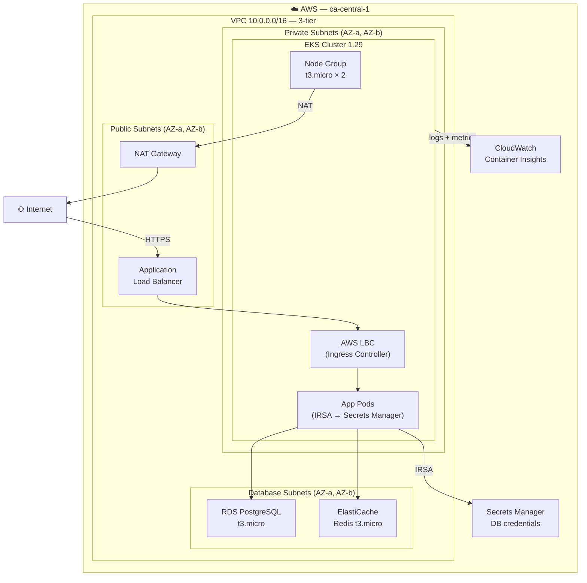

# aws-eks-platform-terraform

[](https://www.credly.com/org/amazon-web-services/badge/aws-certified-solutions-architect-associate)
[](https://www.credly.com/org/hashicorp/badge/hashicorp-certified-terraform-associate-003)
[](https://github.com/HermannDj/aws-eks-platform-terraform/actions/workflows/pr-checks.yml)
[](https://github.com/HermannDj/aws-eks-platform-terraform/actions/workflows/merge-plan.yml)
[](LICENSE)

> Production-grade EKS platform on AWS — Terraform modules, IRSA, multi-environment, GitOps-ready CI/CD.  
> Cost-controlled: dev deployable at ~$0.15/h, destroy when done.

---

## Architecture



---

## Why this architecture

### VPC 3-tier
Separation of concerns at the network level: public (internet-facing), private (compute), database (no internet route). EKS nodes never have public IPs. RDS and Redis are unreachable from the internet even if a security group is misconfigured.

### IRSA (IAM Roles for Service Accounts)
Instead of granting AWS permissions to entire EC2 nodes, each pod assumes a specific IAM Role via OIDC. A compromised pod cannot access resources it doesn't own. This is the AWS-recommended pattern since 2019 and replaces `kube2iam`/`kiam`.

### Single NAT Gateway in dev
HA requires one NAT per AZ (~$32/month each). Dev uses one shared NAT (~$32/month total). The `single_nat_gateway` variable flips this at plan time — no code change needed between environments.

### RDS PostgreSQL (not Aurora) in dev
Aurora has no Free Tier. RDS PostgreSQL t3.micro is Free Tier eligible (12 months). The module supports upgrading to Aurora by changing `engine = "aurora-postgresql"` in prod — same interface, different cost.

### Infracost on every PR
Cost is an architectural decision. Infracost posts a diff on every PR showing exactly what a change adds to the monthly bill. This is standard in consulting teams.

---

## Cost breakdown

### Dev (deployable, Free Tier maximized)

| Service | Config | Cost/h | Notes |
|---|---|---|---|
| EKS control plane | — | $0.10 | Unavoidable |
| EC2 nodes | t3.micro × 2 | ~$0 | Free Tier 750h/month |
| RDS | db.t3.micro | ~$0 | Free Tier 750h/month |
| ElastiCache | cache.t3.micro | ~$0 | Free Tier 750h/month |
| NAT Gateway | × 1 | $0.045 | |
| ALB | — | ~$0 | Free Tier 750h/month |
| **Total** | | **~$0.15/h** | **~$0.45 for a 3h demo** |

### Prod (estimated via Infracost)

| Service | Config | Cost/month |
|---|---|---|
| EKS control plane | — | $73 |
| EC2 nodes | t3.medium × 3 | ~$90 |
| RDS | db.t3.medium Multi-AZ | ~$60 |
| ElastiCache | cache.r6g.large × 2 | ~$100 |
| NAT Gateway | × 3 | ~$96 |
| ALB | — | ~$20 |
| **Total** | | **~$439/month** |

> Run `infracost breakdown --path environments/prod` for the exact current estimate.

---

## Project structure

```
aws-eks-platform-terraform/
├── modules/
│   ├── vpc/          # VPC 3-tier, NAT Gateway, Flow Logs
│   ├── eks/          # Cluster, Node Group, IRSA OIDC provider
│   ├── rds/          # PostgreSQL, Parameter Group, SG
│   ├── elasticache/  # Redis, chiffrement transit+repos
│   ├── alb/          # SG, IRSA AWS Load Balancer Controller
│   ├── security/     # KMS CMK, Secrets Manager, IRSA app
│   └── monitoring/   # CloudWatch Container Insights, alarmes
├── environments/
│   ├── dev/          # ← Deployable (~$0.15/h)
│   ├── staging/      # Plan only
│   └── prod/         # Plan only — NEVER auto-apply
├── .github/workflows/
│   ├── pr-checks.yml    # fmt → validate → tflint → checkov → plan
│   ├── merge-plan.yml   # plan dev+staging+prod on merge
│   └── infracost.yml    # cost estimate comment on PR
├── .pre-commit-config.yaml
└── .tflint.hcl
```

---

## Deployment (dev)

### Prerequisites
- Terraform >= 1.7
- AWS CLI + profile configured
- kubectl
- helm

### Step 1 — Bootstrap remote state

```bash
# Create S3 bucket + DynamoDB lock table (one-time)
aws s3api create-bucket \
  --bucket eks-platform-terraform-state \
  --region ca-central-1 \
  --create-bucket-configuration LocationConstraint=ca-central-1

aws s3api put-bucket-versioning \
  --bucket eks-platform-terraform-state \
  --versioning-configuration Status=Enabled

aws dynamodb create-table \
  --table-name eks-platform-terraform-locks \
  --attribute-definitions AttributeName=LockID,AttributeType=S \
  --key-schema AttributeName=LockID,KeyType=HASH \
  --billing-mode PAY_PER_REQUEST \
  --region ca-central-1
```

### Step 2 — Deploy dev (~$0.15/h)

```bash
cd environments/dev/

terraform init
terraform plan -var="db_password=YourSecurePassword123!"
terraform apply -var="db_password=YourSecurePassword123!"
```

### Step 3 — Configure kubectl

```bash
# Output by Terraform after apply
aws eks update-kubeconfig --region ca-central-1 --name eks-platform-dev

kubectl get nodes
# NAME                          STATUS   ROLES    AGE   VERSION
# ip-10-0-x-x.ca-central-1...  Ready    <none>   2m    v1.29.x
```

### Step 4 — Deploy AWS Load Balancer Controller

```bash
helm repo add eks https://aws.github.io/eks-charts
helm repo update

helm install aws-load-balancer-controller eks/aws-load-balancer-controller \
  -n kube-system \
  --set clusterName=eks-platform-dev \
  --set serviceAccount.annotations."eks\.amazonaws\.com/role-arn"=$(terraform output -raw lbc_role_arn)
```

### Step 5 — Destroy when done (avoid costs)

```bash
terraform destroy -var="db_password=YourSecurePassword123!"
# All resources deleted — back to $0
```

---

## Live deployment proof

> Deployed 2026-04-10 — `ca-central-1` — destroyed after demo to avoid costs.

### EKS cluster — 3 nodes Ready

```
$ kubectl get nodes
NAME                                           STATUS   ROLES    AGE   VERSION
ip-10-0-35-123.ca-central-1.compute.internal   Ready    <none>   60m   v1.30.14-eks-f69f56f
ip-10-0-37-206.ca-central-1.compute.internal   Ready    <none>   23m   v1.30.14-eks-f69f56f
ip-10-0-62-187.ca-central-1.compute.internal   Ready    <none>   60m   v1.30.14-eks-f69f56f
```

### All pods Running — IRSA verified

```
$ kubectl get pods -A
NAMESPACE     NAME                                            READY   STATUS    AGE
demo          demo-app-568b784f7c-5kggh                       1/1     Running   8m
demo          demo-app-568b784f7c-zhp22                       1/1     Running   7m
kube-system   aws-load-balancer-controller-7689685cb5-d8ndb   1/1     Running   8m   ← IRSA
kube-system   aws-load-balancer-controller-7689685cb5-k9crc   1/1     Running   7m   ← IRSA
kube-system   aws-node-qr6qd                                  2/2     Running   60m
kube-system   coredns-68c6b7b454-kvgwx                        1/1     Running   86m
kube-system   kube-proxy-5w82f                                1/1     Running   60m
```

### AWS Load Balancer Controller created a real ALB

```
$ kubectl get ingress -n demo
NAME           CLASS   HOSTS   ADDRESS                                                                 PORTS
demo-ingress   <none>   *      k8s-demo-demoingr-1a750c6c0e-1160151584.ca-central-1.elb.amazonaws.com  80

$ curl http://k8s-demo-demoingr-1a750c6c0e-1160151584.ca-central-1.elb.amazonaws.com
<title>Welcome to nginx!</title>  ✓
```

### RDS + ElastiCache available

```
$ aws rds describe-db-instances --query "DBInstances[?DBInstanceIdentifier=='eks-platform-dev-postgres'].{ID:DBInstanceIdentifier,Status:DBInstanceStatus,Version:EngineVersion}" --output table
+-----------------------------+------------+-----------+
|             ID              |   Status   |  Version  |
+-----------------------------+------------+-----------+
|  eks-platform-dev-postgres  | available  |  15.10    |
+-----------------------------+------------+-----------+

$ aws elasticache describe-replication-groups --query "ReplicationGroups[?ReplicationGroupId=='eks-platform-dev-redis'].{ID:ReplicationGroupId,Status:Status}" --output table
+-------------------------+-------------+
|           ID            |   Status    |
+-------------------------+-------------+
|  eks-platform-dev-redis |  available  |
+-------------------------+-------------+
```

### Terraform outputs

```
cluster_name           = "eks-platform-dev"
vpc_id                 = "vpc-01cb562519697dbf8"
nat_gateway_public_ips = ["52.60.219.163"]
lbc_role_arn           = "arn:aws:iam::619071315221:role/eks-platform-dev-aws-load-balancer-controller"
secrets_reader_role_arn = "arn:aws:iam::619071315221:role/eks-platform-dev-secrets-reader"
```

---

## CI/CD pipeline

```
PR opened:
  fmt + validate ──────────────────────────────┐
                                                ├─► tflint ──┐
                                                └─► checkov ─┤
                                                              └─► terraform plan (dev)
                                                                   └─ Comment on PR

  infracost ──────────────────────────────────────────────────► Cost diff comment on PR

Merge to main:
  plan dev + staging + prod (matrix, parallel)
  └─ NEVER auto-apply
```

### GitHub Secrets required

| Secret | Description |
|---|---|
| `AWS_ACCESS_KEY_ID` | CI/CD AWS access key |
| `AWS_SECRET_ACCESS_KEY` | CI/CD AWS secret key |
| `DB_PASSWORD` | PostgreSQL password for plan |
| `INFRACOST_API_KEY` | Free at infracost.io |

---

## Architecture Decision Records

### ADR-001 — EKS Managed Node Groups vs Self-managed

**Decision**: Managed Node Groups  
**Reason**: AWS handles node lifecycle (AMI updates, draining). Self-managed adds operational overhead with no benefit at this scale. Karpenter would be the next step for cost-optimized autoscaling.

### ADR-002 — RDS PostgreSQL vs Aurora

**Decision**: PostgreSQL in dev, Aurora-ready interface in prod  
**Reason**: Aurora has no Free Tier ($29+/month minimum). The module uses the same interface — switching engine in prod is a one-line change. Multi-AZ RDS is sufficient for staging.

### ADR-003 — IRSA vs Node IAM Role

**Decision**: IRSA for all AWS service access from pods  
**Reason**: Node IAM roles grant permissions to ALL pods on the node. IRSA scopes permissions to a specific ServiceAccount. Blast radius of a pod compromise is contained.

### ADR-004 — Single NAT Gateway in dev

**Decision**: `single_nat_gateway = true` in dev  
**Reason**: HA NAT (1/AZ) costs ~$32/month per gateway. Dev doesn't need HA. The variable flips this for prod without code changes.

### ADR-005 — No KMS CMK in dev

**Decision**: `use_kms_cmk = false` in dev  
**Reason**: KMS CMK costs $1/month/key. AWS-managed keys provide encryption at rest at no cost. CMK is enabled in prod for compliance and key rotation control.

---

## Terraform concepts demonstrated

| Concept | Where |
|---|---|
| Modules with variables/outputs | All `modules/` |
| `count` meta-argument | `aws_kms_key`, `aws_sns_topic`, NAT Gateways |
| `depends_on` | EKS node group, API Gateway account |
| `lifecycle` | EKS node group `ignore_changes` |
| Data sources | `aws_caller_identity`, `tls_certificate`, `aws_iam_policy_document` |
| Remote state S3 + DynamoDB | All `environments/` |
| IRSA pattern | `modules/security`, `modules/alb`, `modules/monitoring` |
| `sensitive = true` | DB password, cluster CA, credentials |
| `validation` blocks | environment, vpc_cidr, availability_zones |
| `jsonencode` | IAM policies, KMS key policy |
| Multi-environment matrix | `merge-plan.yml` |

---

## License

MIT
